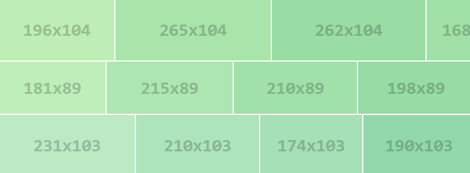

# image-placeholder.js

A javascript lib to generate `placeholder image` on client browser side. [EN-Readme](README.md)

## 预览

[官方网站示例](http://github.atool.org/placeholder.js.html)

## 特点

1. 不依赖任何 js 框架，比如 jq
2. 小于 1k ，具体是`0.98k`
3. 配置项多，都有默认值
4. 使用简单

## 使用

see file `index.html`, or below:
	
	//option config
	var opts = {
      	size: '512x256', //image size, default: '128x128'
		bgcolor: '#ccc', //background-color, default: random color
		color: '#969696', //text color, default: random color
		text: 'Hello World, 你好', //text on image, default: size
      	font: {
        	style:'oblique', //font-style, can be: normal / italic / oblique, default: 'oblique'
			weight: 'bold', //font-weight, can be: normal / bold / bolder / lighter / Number, default: 'bold'
        	size:'40', //font-size: Number, default: 30
			family: 'consolas' //font-family, default: 'consolas'
      },
      
    }
	//API method
	//1. get the image base64 
	window.placeholder.getData(opts); 
	//2. get the image canvas element
	window.placeholder.getCanvas(opts); //get the image canvas element

## 为什么要造轮子

1. 很多 image placeholder 都是在服务端生成，需要额外搭建服务以及耗费资源
2. [imsky/holder]( https://github.com/imsky/holder)是客户端生成，大名鼎鼎，但是在用到网页上，动态图片的时候，它的那种风格用起来不太方便
3. 其他的 image placeholder 太大了，比如上面提到的 holder 压缩之后还有 30k 以上，其实`不太使用在网页上使用`。

## 待完成

1. 更多的灵活配置
2. font-size 自动计算，以防止文字太多的时候，超过图片大小

## 其他

任何问题欢迎反馈和 pr ，代码非常简单，相信 1 分钟你就可以看懂，非常欢迎`push request`。